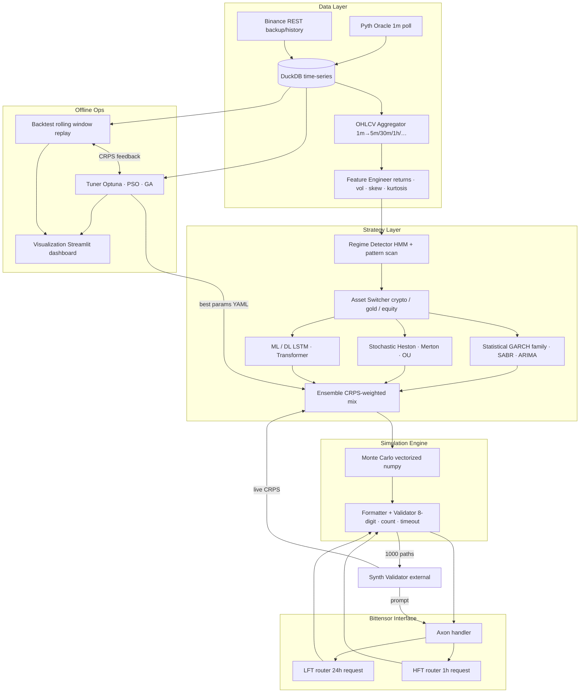
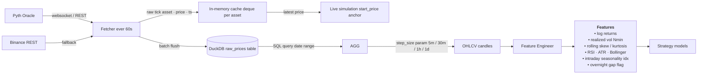
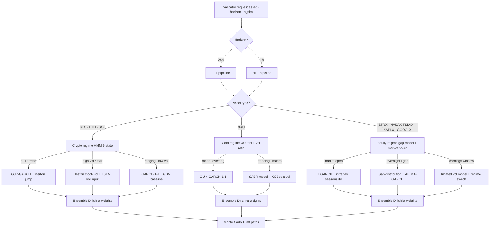
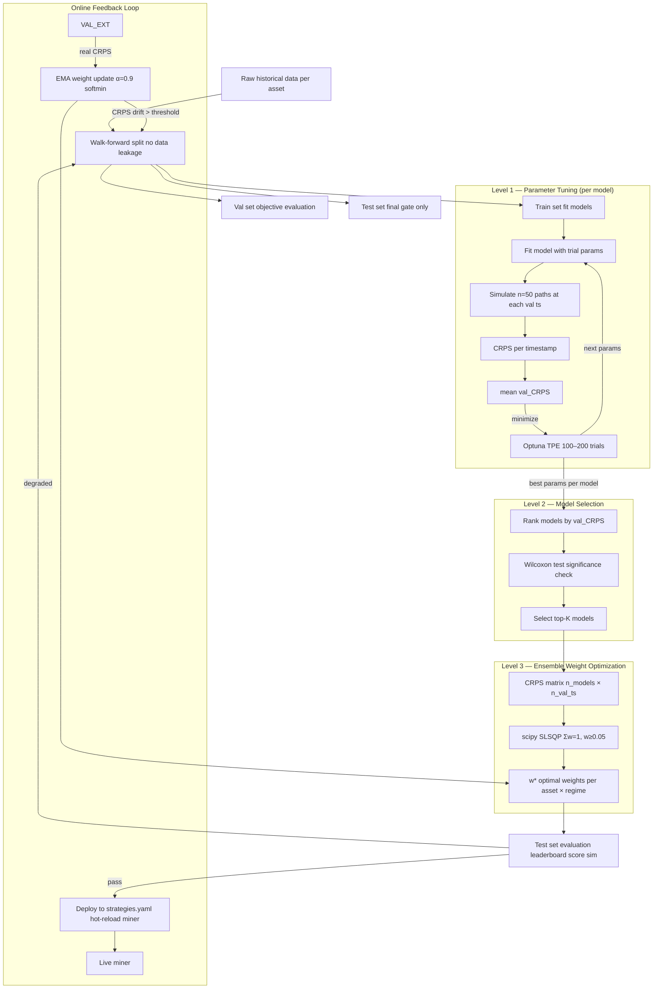
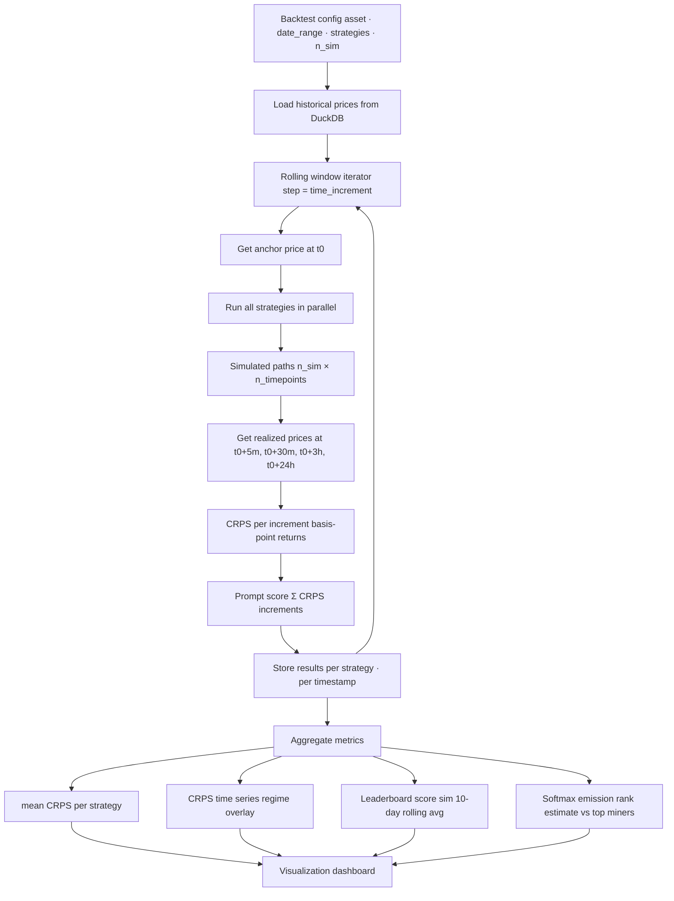
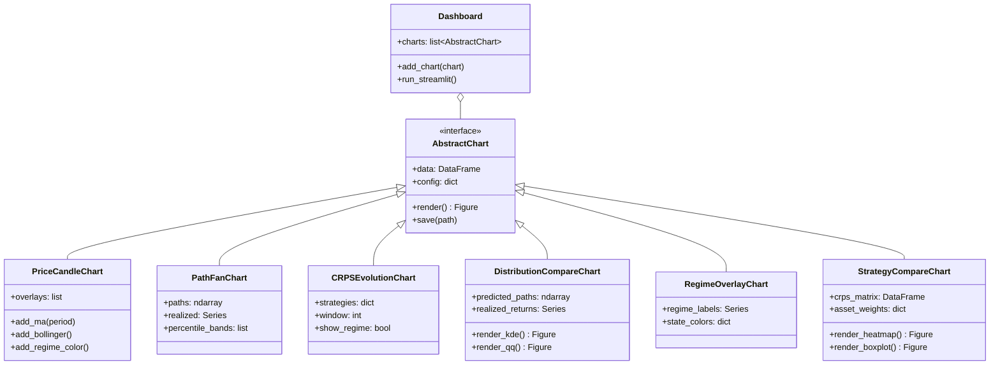
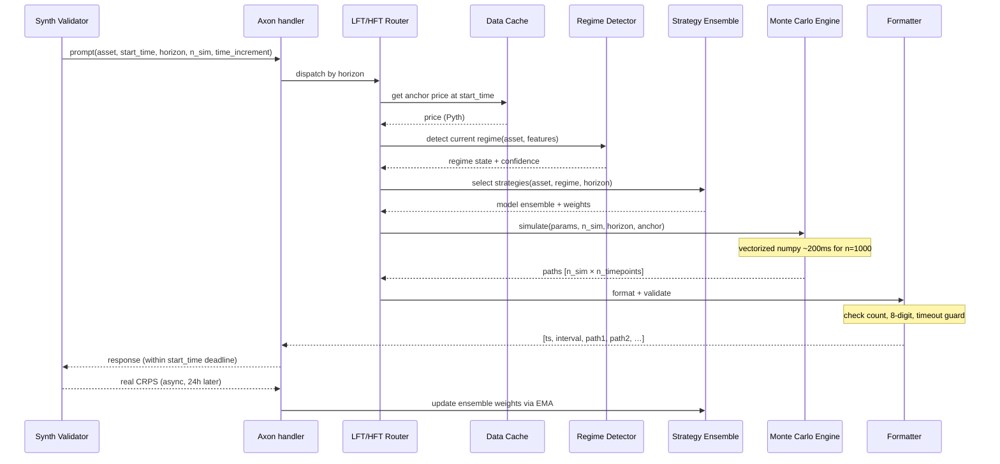

# Synth Miner — Hướng Dẫn Kiến Trúc Hệ Thống

> **Phiên bản**: v2.0 — Tái cấu trúc toàn diện  
> **Mục tiêu**: Chuyển từ cấu trúc monolithic hiện tại sang kiến trúc modular, tối ưu cho CRPS scoring trên Bittensor Subnet 50.

---

## Mục Lục

1. [Tổng Quan Kiến Trúc](#1-tổng-quan-kiến-trúc)
2. [Luồng Dữ Liệu: Fetch → Store → Features](#2-luồng-dữ-liệu)
3. [Chiến Lược Theo Asset × Regime](#3-chiến-lược-theo-asset--regime)
4. [Pipeline Tuning Dựa Trên CRPS](#4-pipeline-tuning-dựa-trên-crps)
5. [Backtest Engine](#5-backtest-engine)
6. [Visualization Module](#6-visualization-module)
7. [Live Miner Request Flow](#7-live-miner-request-flow)
8. [Cấu Trúc Thư Mục Chi Tiết](#8-cấu-trúc-thư-mục-chi-tiết)
9. [Migration từ Codebase Hiện Tại](#9-migration-từ-codebase-hiện-tại)
10. [Hướng Dẫn Phát Triển](#10-hướng-dẫn-phát-triển)

---

## 1. Tổng Quan Kiến Trúc

Hệ thống được chia thành **5 layer chính**:



### Mô tả các Layer

| Layer | Trách nhiệm | Module chính |
|-------|-------------|--------------|
| **Data** | Thu thập, lưu trữ, aggregate giá, tính features | `data/fetchers/`, `data/storage/`, `data/loaders/` |
| **Strategy** | Phát hiện regime, chọn model, ensemble | `strategies/regime/`, `strategies/statistical/`, `strategies/ensemble/` |
| **Simulation** | Chạy Monte Carlo, format output | `simulation/engine.py`, `simulation/formatter.py` |
| **Offline Ops** | Backtest, tuning hyperparams, visualization | `backtest/`, `training/`, `visualization/` |
| **Bittensor** | Axon handler, dispatch LFT/HFT | `neurons/miner.py` |

---

## 2. Luồng Dữ Liệu



### Chi tiết triển khai

**Fetchers** (`data/fetchers/`):
- `base_fetcher.py` — ABC định nghĩa `fetch()`, `start_polling()`, `stop()`
- `pyth_fetcher.py` — Nguồn chính, poll mỗi 60s qua REST/WebSocket
- `binance_fetcher.py` — Backup + bulk history download

**Storage** (`data/storage/`):
- `timeseries_db.py` — DuckDB wrapper: `insert_tick()`, `query_range(asset, start, end)`
  - Thay thế SQLite hiện tại (`synth/miner/data/price_data.db`) bằng DuckDB cho analytical queries nhanh hơn
- `market_cache.py` — `collections.deque` per asset, giữ N ticks gần nhất trong RAM

**Loaders** (`data/loaders/`):
- `ohlcv_aggregator.py` — Resample 1m raw → OHLCV(5m/30m/1h/1d) bằng pandas resample
- `feature_engineer.py` — Tính toán tất cả technical indicators + statistical features

---

## 3. Chiến Lược Theo Asset × Regime



### Mapping Asset → Regime → Strategy

| Asset Group | Regime Detector | States | Strategy Bank |
|------------|----------------|--------|--------------|
| **Crypto** (BTC, ETH, SOL) | HMM 3-state | bull / high-vol / ranging | GJR-GARCH+Merton, Heston+LSTM, GARCH+GBM |
| **Gold** (XAU) | OU-test + vol ratio | mean-reverting / trending | OU+GARCH, SABR+XGBoost |
| **Equity** (SPYX, NVDAX, TSLAX, AAPLX, GOOGLX) | Gap model + market hours | open / overnight / earnings | EGARCH+seasonal, Gap+ARIMA, Inflated vol |

### Registry Pattern

```python
# strategies/registry.py
class StrategyRegistry:
    _registry: dict[tuple[str, str], list[type[BaseStrategy]]] = {}

    @classmethod
    def register(cls, asset_type: str, regime: str, strategy_cls: type):
        key = (asset_type, regime)
        cls._registry.setdefault(key, []).append(strategy_cls)

    @classmethod
    def get(cls, asset_type: str, regime: str) -> list[BaseStrategy]:
        return [s() for s in cls._registry.get((asset_type, regime), [])]
```

---

## 4. Pipeline Tuning Dựa Trên CRPS



### 3 Levels Tuning

| Level | Mục tiêu | Tool | Output |
|-------|----------|------|--------|
| **L1** Parameter | Tối ưu params từng model | Optuna TPE (100-200 trials) | `best_params` per model |
| **L2** Selection | Chọn top-K models có ý nghĩa thống kê | Wilcoxon signed-rank test | Top-K model list |
| **L3** Ensemble | Tối ưu trọng số mix | scipy SLSQP (Σw=1, w≥0.05) | `w*` per asset×regime |

### Online Feedback Loop
- Validator trả CRPS thực sau 24h → EMA update ensemble weights
- Nếu CRPS drift > threshold → trigger retrain pipeline

---

## 5. Backtest Engine



### Metrics quan trọng

| Metric | Mô tả | File |
|--------|-------|------|
| `mean_crps` | CRPS trung bình per strategy | `backtest/metrics.py` |
| `rolling_leaderboard` | Simulate điểm leaderboard rolling 10 ngày | `backtest/metrics.py` |
| `softmax_emission` | Ước lượng emission rank với β=-0.1 | `backtest/metrics.py` |
| `crps_ensemble` | CRPS tính bằng sort trick O(N log N) | `backtest/crps.py` |

---

## 6. Visualization Module

### Class Hierarchy



### Dashboard Tabs (Streamlit)

| Tab | Nội dung |
|-----|---------|
| **Live** | Real-time price + fan chart paths đang chạy |
| **Backtest** | CRPS evolution, leaderboard sim, regime overlay |
| **Training** | Optuna study progress, best params table |
| **Compare** | Strategy heatmap, boxplot CRPS distribution |

---

## 7. Live Miner Request Flow



### Timing Budget

| Bước | Thời gian ước tính |
|------|-------------------|
| Price fetch từ cache | < 1ms |
| Regime detection | ~50ms |
| Strategy selection | ~10ms |
| Monte Carlo (1000 paths) | ~200ms |
| Format + validate | ~20ms |
| **Tổng** | **< 300ms** (budget: đến start_time, ~60s) |

---

## 8. Cấu Trúc Thư Mục Chi Tiết

```
synth-miner/
│
├── config/
│   ├── assets.yaml                   # Per-asset: emission weight, type, model priors
│   ├── strategies.yaml               # Active strategy + best params per asset × regime
│   └── system.yaml                   # num_simulations, mode (test/prod), DB path, ports
│
├── data/
│   ├── __init__.py
│   ├── fetchers/
│   │   ├── __init__.py
│   │   ├── base_fetcher.py           # ABC: fetch(), start_polling(), stop()
│   │   ├── pyth_fetcher.py           # Pyth Oracle — primary source, 1m poll
│   │   └── binance_fetcher.py        # Binance REST — backup + bulk history
│   ├── storage/
│   │   ├── __init__.py
│   │   ├── timeseries_db.py          # DuckDB wrapper: insert, query by range/asset
│   │   └── market_cache.py           # In-memory deque per asset (latest N ticks)
│   └── loaders/
│       ├── __init__.py
│       ├── ohlcv_aggregator.py       # Resample 1m ticks → OHLCV(step_size)
│       └── feature_engineer.py       # log_returns, vol, skew, kurt, RSI, ATR, BB
│
├── strategies/
│   ├── __init__.py
│   ├── base.py                       # BaseStrategy(ABC): fit(), simulate(), suggest_params()
│   ├── registry.py                   # StrategyRegistry: register/get per (asset, regime)
│   ├── statistical/
│   │   ├── gbm.py                    # Geometric Brownian Motion (baseline)
│   │   ├── garch.py                  # GARCH(p,q) — arch lib
│   │   ├── gjr_garch.py              # GJR-GARCH — leverage effect
│   │   ├── egarch.py                 # EGARCH — equity
│   │   ├── figarch.py                # FIGARCH — long memory vol
│   │   ├── arima_garch.py            # ARIMA mean + GARCH vol combo
│   │   └── sabr.py                   # SABR stochastic vol (XAU)
│   ├── stochastic/
│   │   ├── heston.py                 # Heston — Euler-Maruyama
│   │   ├── merton_jump.py            # Merton jump diffusion
│   │   ├── kou_jump.py               # Kou double-exponential jump
│   │   └── ornstein_uhlenbeck.py     # OU mean-reversion (XAU)
│   ├── ml/
│   │   ├── lstm_vol.py               # LSTM → vol prediction → GARCH input
│   │   ├── transformer_vol.py        # Attention-based vol (HFT)
│   │   ├── xgboost_regime.py         # XGBoost regime classifier
│   │   └── gap_model.py              # Overnight gap distribution (equity)
│   ├── regime/
│   │   ├── hmm_detector.py           # HMM 3-state — hmmlearn
│   │   ├── pattern_detector.py       # Rule-based: RSI, BB, volume spike
│   │   └── regime_switcher.py        # HMM + pattern → regime state + routing
│   └── ensemble/
│       ├── weighted_ensemble.py      # Mix N model path-sets with w*
│       └── meta_learner.py           # Online EMA weight update from live CRPS
│
├── simulation/
│   ├── __init__.py
│   ├── engine.py                     # run() → ndarray (n_sim × n_timepoints), Numba JIT
│   ├── formatter.py                  # to_synth_format(), round 8 significant digits
│   └── local_validator.py            # check_format() → (ok, error_msg)
│
├── backtest/
│   ├── __init__.py
│   ├── engine.py                     # BacktestEngine.run(config) → BacktestResult
│   ├── crps.py                       # crps_ensemble() — sort trick O(N log N)
│   └── metrics.py                    # rolling_leaderboard, softmax_emission_rank
│
├── training/
│   ├── __init__.py
│   ├── data_split.py                 # walk_forward_split() — time-ordered, no leakage
│   ├── feature_store.py              # Precompute + cache features to DuckDB
│   ├── optimizer.py                  # CRPSObjective + optuna_tune / pso / ga
│   ├── tuner.py                      # AssetTuner: L1→L2→L3 orchestration
│   └── experiment_tracker.py         # WandB / MLflow logging
│
├── visualization/
│   ├── __init__.py
│   ├── base_chart.py                 # AbstractChart(ABC)
│   ├── charts/
│   │   ├── price_candle.py
│   │   ├── path_fan.py
│   │   ├── crps_evolution.py
│   │   ├── distribution_compare.py
│   │   ├── regime_overlay.py
│   │   └── strategy_compare.py
│   └── dashboard.py                  # Streamlit app — 4 tabs
│
├── neurons/
│   └── miner.py                      # Bittensor Axon — entry point (DO NOT RENAME)
│
├── tests/
│   ├── test_crps.py                  # unit: crps sort trick == naive
│   ├── test_formatter.py             # unit: format + validate
│   ├── test_ohlcv.py                 # unit: aggregation correctness
│   ├── test_strategies.py            # smoke: simulate() → correct shape
│   ├── test_backtest.py              # integration: BacktestEngine
│   └── test_tuner.py                 # integration: tune GARCH on 30d BTC
│
├── scripts/
│   ├── fetch_history.py              # Backfill via Binance REST
│   ├── run_backtest.py               # CLI backtest runner
│   ├── run_tuner.py                  # CLI tuner
│   └── run_dashboard.py              # streamlit run
│
├── miner.config.js                   # PM2 — mainnet
├── miner.test.config.js              # PM2 — testnet (netuid 247)
├── requirements.txt
├── requirements-dev.txt
└── README.md
```

---

## 9. Migration từ Codebase Hiện Tại

### Mapping cũ → mới

| File/Module cũ | File/Module mới | Ghi chú |
|----------------|-----------------|---------|
| `synth/miner/data_handler.py` | `data/fetchers/pyth_fetcher.py` + `data/storage/` | Tách fetch logic khỏi storage |
| `synth/miner/fetch_daemon.py` | `data/fetchers/base_fetcher.py` | Polling loop → ABC pattern |
| `synth/miner/data/price_data.db` (SQLite) | `data/storage/timeseries_db.py` (DuckDB) | Upgrade DB engine |
| `synth/miner/strategies/base.py` | `strategies/base.py` | Giữ nguyên interface, thêm `suggest_params()` |
| `synth/miner/strategies/registry.py` | `strategies/registry.py` | Thêm regime-aware routing |
| `synth/miner/strategies/garch_v1.py` | `strategies/statistical/garch.py` | Consolidate v1/v2 |
| `synth/miner/strategies/gjr_garch.py` | `strategies/statistical/gjr_garch.py` | Di chuyển trực tiếp |
| `synth/miner/strategies/egarch.py` | `strategies/statistical/egarch.py` | Di chuyển trực tiếp |
| `synth/miner/strategies/jump_diffusion.py` | `strategies/stochastic/merton_jump.py` | Rename + refactor |
| `synth/miner/strategies/mean_reversion.py` | `strategies/stochastic/ornstein_uhlenbeck.py` | Formalize OU model |
| `synth/miner/strategies/regime_switching.py` | `strategies/regime/hmm_detector.py` | Tách detection khỏi strategy |
| `synth/miner/strategies/ensemble_weighted.py` | `strategies/ensemble/weighted_ensemble.py` | Thêm CRPS-based weighting |
| `synth/miner/core/regime_detection.py` | `strategies/regime/regime_switcher.py` | Nâng cấp multi-asset |
| `synth/miner/simulations.py` | `simulation/engine.py` | Vectorize + Numba JIT |
| `synth/miner/my_simulation.py` | `simulation/engine.py` | Merge vào engine chính |
| `synth/miner/backtest/runner.py` | `backtest/engine.py` | Rolling window pattern |
| `synth/miner/backtest/metrics.py` | `backtest/metrics.py` | Thêm leaderboard sim |
| `synth/miner/backtest/tuner.py` | `training/tuner.py` | Tách riêng module training |
| `synth/miner/backtest/duel.py` | `backtest/engine.py` + `training/optimizer.py` | Tách backtest vs tuning |
| `synth/miner/compute_score.py` | `backtest/crps.py` | Sort trick optimization |
| `neurons/miner.py` | `neurons/miner.py` | **KHÔNG RENAME** — thêm LFT/HFT router |

### Config Migration

| Config cũ | Config mới | Nội dung |
|-----------|-----------|---------|
| Hard-coded trong code | `config/assets.yaml` | Emission weights, asset types |
| Hard-coded trong code | `config/strategies.yaml` | Best params per asset×regime |
| `.env` + `synth/utils/config.py` | `config/system.yaml` + `.env` | System settings, DB path |

### Dependencies mới cần thêm

```txt
# requirements.txt — additions
duckdb>=0.10.0              # Thay thế SQLite cho time-series
hmmlearn>=0.3.0             # HMM regime detection
optuna>=3.5.0               # Hyperparameter tuning
torch>=2.0.0                # LSTM / Transformer
xgboost>=2.0.0              # XGBoost regime classifier
streamlit>=1.30.0           # Visualization dashboard
plotly>=5.18.0              # Interactive charts
```

---

## 10. Hướng Dẫn Phát Triển

### Thêm Strategy Mới

1. Tạo file trong `strategies/statistical/`, `stochastic/`, hoặc `ml/`
2. Kế thừa `BaseStrategy`:

```python
from strategies.base import BaseStrategy

class MyStrategy(BaseStrategy):
    name = "my_strategy"

    def fit(self, data: pd.DataFrame) -> None:
        """Fit model trên historical data."""
        ...

    def simulate(self, n_sim: int, horizon: int,
                 anchor: float, step: int) -> np.ndarray:
        """Return shape (n_sim, n_timepoints)."""
        ...

    def suggest_params(self, trial) -> dict:
        """Optuna trial → hyperparameter dict."""
        return {
            "param_a": trial.suggest_float("param_a", 0.01, 0.5),
            "param_b": trial.suggest_int("param_b", 1, 10),
        }
```

3. Đăng ký trong `strategies/registry.py`:
```python
StrategyRegistry.register("crypto", "bull", MyStrategy)
```

4. Chạy smoke test:
```bash
pytest tests/test_strategies.py -k "my_strategy"
```

### Chạy Backtest

```bash
python scripts/run_backtest.py \
    --asset BTC \
    --start 2025-01-01 \
    --end 2025-03-01 \
    --strategies garch,gjr_garch,heston \
    --n_sim 100
```

### Chạy Tuner

```bash
python scripts/run_tuner.py \
    --asset all \
    --n_trials 200 \
    --output config/strategies.yaml
```

### Chạy Dashboard

```bash
streamlit run scripts/run_dashboard.py
```

### Coding Conventions

| Quy tắc | Chi tiết |
|---------|---------|
| **Type hints** | Bắt buộc cho tất cả public functions |
| **Docstrings** | Google style, bao gồm `Args`, `Returns`, `Raises` |
| **Testing** | Mỗi strategy mới phải có smoke test |
| **Config** | Không hard-code params — dùng YAML config |
| **Simulation output** | Luôn trả `np.ndarray` shape `(n_sim, n_timepoints)` |
| **CRPS calculation** | Dùng basis-point returns, không dùng raw price |

---

> **Lưu ý quan trọng**: File `neurons/miner.py` là entry point của Bittensor — **KHÔNG ĐƯỢC ĐỔI TÊN**. Mọi logic mới phải được import vào file này, không thay đổi signature của Axon handler.
