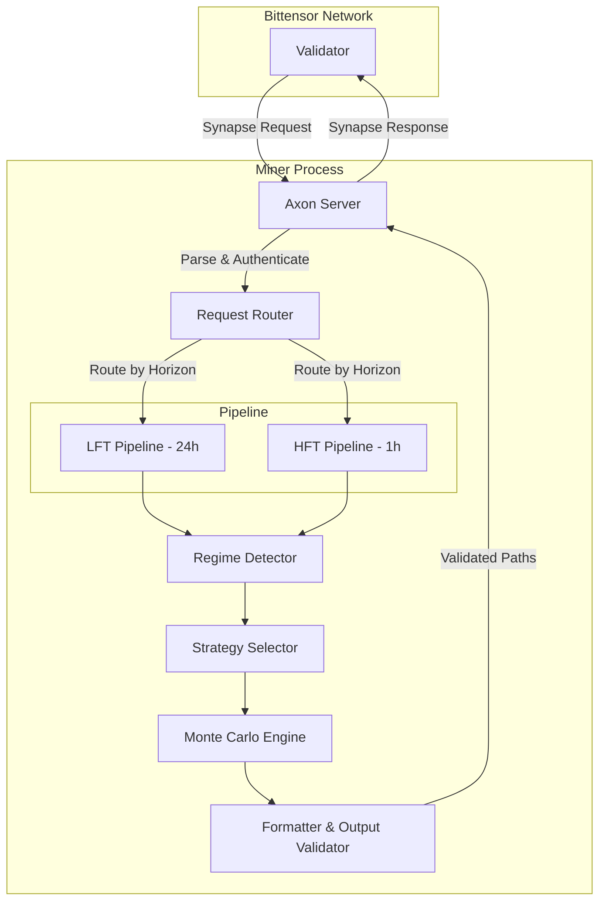
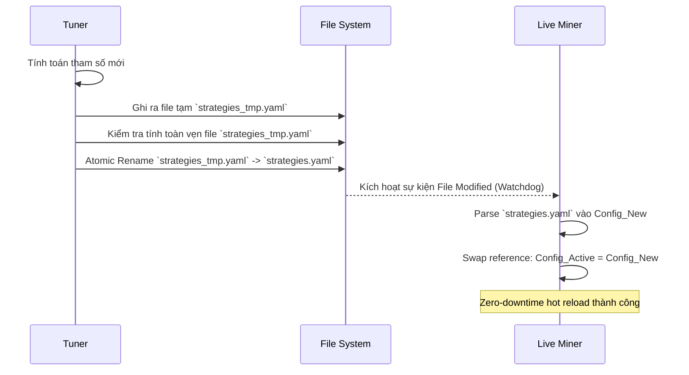

# Cấu Trúc Hệ Thống (Architecture)

## System Overview
Hệ thống Synth Miner là một nền tảng trading algorithmic phi tập trung trên mạng lưới Bittensor (Subnet 50), chuyên cung cấp các dự báo chuỗi thời gian tài chính (financial time-series) cho đa dạng tài sản (Crypto, Equity, Forex). Hệ thống được thiết kế với kiến trúc modular, tách biệt hoàn toàn giữa các tiến trình (process isolation) như thu thập dữ liệu (fetcher), huấn luyện mô hình (tuner/trainer), mô phỏng backtest và xử lý live request (miner). Sự tách biệt này giúp tối ưu hóa khả năng mở rộng, tránh xung đột tài nguyên (đặc biệt là I/O trên DuckDB), đồng thời đảm bảo miner luôn phản hồi với độ trễ thấp nhất nhờ cơ chế fallback (degradation chain) và zero-downtime hot-reload.

## Component Map
Biểu đồ luồng dữ liệu chính xác thể hiện quá trình tương tác giữa các component trong hệ thống, tập trung vào luồng xử lý Request/Response.

## Data Flow — Request Lifecycle
Luồng xử lý từ khi Validator gửi yêu cầu đến khi Miner trả về kết quả:
1. **Tiếp nhận (Axon Server)**: Axon nhận Synapse request từ Validator (bao gồm thông tin tài sản, horizon, n_sim).
2. **Định tuyến (Request Router)**: Xác định loại request (LFT - 24h hoặc HFT - 1h) và phân luồng tương ứng.
3. **Phân tích bối cảnh (Regime Detector)**: Truy xuất các feature mới nhất từ bộ nhớ cache/in-memory (đã được fetcher nạp) để xác định trạng thái thị trường (bull, bear, high-vol, v.v.).
4. **Chọn chiến thuật (Strategy Selector)**: Dựa trên Asset và Regime hiện tại, tra cứu `StrategyRegistry` để lấy ra chiến thuật (hoặc ensemble) tối ưu nhất được định nghĩa trong `strategies.yaml`.
5. **Mô phỏng (Monte Carlo Engine)**: Khởi chạy các model đã chọn (Heston, GARCH, LSTM...) để sinh ra `n_sim` kịch bản giá (price paths). Quá trình này được vector hóa để tối ưu tốc độ.
6. **Định dạng & Kiểm tra (Formatter & Output Validator)**: Chuẩn hóa output (làm tròn 8 chữ số thập phân, đảm bảo không có NaN/Inf), giới hạn thời gian thực thi (timeout guard).
7. **Phản hồi (Axon Server)**: Axon trả kết quả đã format về lại cho Validator.

## Storage Architecture
Để tối ưu hiệu suất và đảm bảo tính nhất quán của dữ liệu, hệ thống sử dụng kiến trúc lưu trữ đa tầng (multi-tier storage) với MySQL là nguồn dữ liệu chính (Source of Truth):

- **MySQL (Primary Market Data DB)**: Lưu trữ toàn bộ dữ liệu giá lịch sử (OHLCV) cho tất cả các tài sản và khung thời gian (1m, 5m).
  - *Writer*: Process `fetch_daemon.py` thực hiện ghi dữ liệu mới mỗi 60 giây.
  - *Reader*: Miner, Tuner, và Backtest Engine đọc dữ liệu trực tiếp từ MySQL để phục vụ tính toán.
- **DuckDB (Analytical Mirror - Tùy chọn)**: Một bản sao (mirror) của dữ liệu từ MySQL được đồng bộ sang DuckDB phục vụ các truy vấn phân tích (OLAP) nhanh hoặc làm bộ nhớ đệm (cache) cho một số tác vụ đặc thù.
  - *Ownership*: `fetch_daemon.py` đảm nhận việc đồng bộ từ MySQL sang DuckDB.
- **Parquet (Feature Store)**: Lưu trữ các đặc trưng (features) đã được tính toán trước phục vụ training/tuner. Parquet file cho phép đọc ghi hiệu quả, có thể tách theo từng file/phân vùng (partition) nên không bị lock.
- **Per-session Storage (Backtest DB)**: Mỗi phiên backtest hoặc tuning sẽ sinh ra một file SQLite hoặc DuckDB tạm thời (ví dụ: `backtest_run_<id>.db`). Tránh hoàn toàn việc các test run đồng thời tranh chấp ghi vào một DB chung.

## Process Isolation Model

| Process / Thread | Target Storage | Ghi chú (Write Permissions) |
|------------------|----------------|------------------------------|
| **Data Fetcher** (Daemon) | `MySQL`, `DuckDB` (Mirror) | Ghi liên tục mỗi 60s vào MySQL. Đồng bộ sang DuckDB nếu được cấu hình. |
| **Live Miner** (Axon) | MySQL, In-memory Cache | Chỉ Read từ MySQL/Cache. Không ghi DB. Ghi log ra file. |
| **Tuner / Trainer** | MySQL, Parquet Store | Read từ MySQL. Ghi feature ra Parquet. Ghi config bằng atomic swap. |
| **Backtest Engine** | MySQL, `backtest_<session>.db` | Read từ MySQL. Tạo file DB riêng biệt cho mỗi session để ghi kết quả. |

## Config Reload Lifecycle
Giải quyết vấn đề race condition khi Tuner cập nhật `strategies.yaml` trong khi Miner đang đọc.

## Degradation Chain
Cơ chế Fallback đảm bảo Miner không bao giờ bị timeout và luôn trả về một kết quả hợp lệ cho Validator dù model có gặp lỗi (OOM, diverge, crash).

| Level | Điều kiện kích hoạt (Trigger) | Models sử dụng | Expected Latency | Output Format |
|-------|-------------------------------|----------------|------------------|---------------|
| **L1 (Primary)** | Normal condition. | Heston, LSTM, HMM + GJR-GARCH | 100ms - 500ms | 1000 paths chuẩn |
| **L2 (Fallback 1)** | Model L1 OOM, Diverge hoặc chạy quá 600ms. | Statistical Models (GARCH-1-1, ARIMA) | < 100ms | 1000 paths chuẩn |
| **L3 (Fallback 2)** | Model L2 lỗi hoặc thiếu dữ liệu lịch sử dài. | Geometric Brownian Motion (GBM) | < 10ms | 1000 paths chuẩn |
| **L4 (Emergency)** | Tất cả L3 lỗi, CPU quá tải, sát giờ timeout. | Flatline (Giữ nguyên giá hiện tại) | < 1ms | 1000 paths không đổi |
