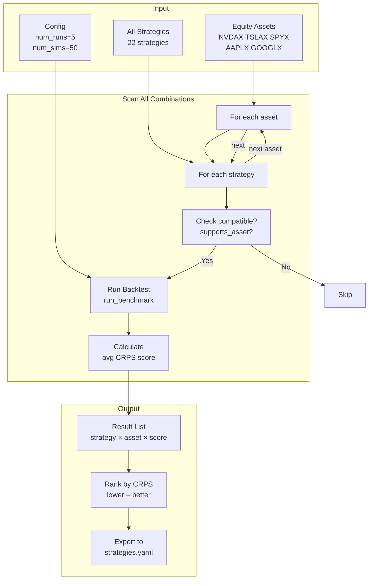
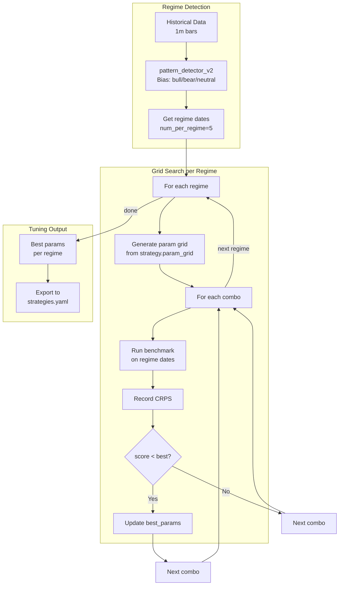
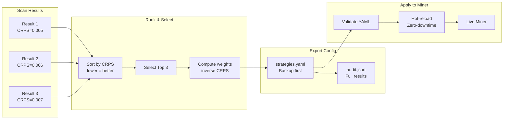

# Hướng Dẫn Backtest & Tuning Cho Cổ Phiếu (Equity)

> **Subnet**: Bittensor Subnet 50
> **Asset**: Equity (NVDAX, TSLAX, SPYX, AAPLX, GOOGLX)
> **Mục tiêu**: Tối ưu CRPS score bằng backtest + tuning theo Asset × Regime

---

## Mục Lục

1. [Tổng Quan Workflow](#1-tổng-quan-workflow)
2. [Các Bước Thực Hiện](#2-các-bước-thực-hiện)
3. [Biểu Đồ Luồng Quy Trình](#3-biểu-đồ-luồng-quy-trình)
4. [Cấu Hình Chiến Lược Equity](#4-cấu-hình-chiến-lược-equity)
5. [Các Lệnh Chạy Cụ Thể](#5-các-lệnh-chạy-cụ-thể)
6. [Hướng Dẫn Chỉnh Sửa](#6-hướng-dẫn-chỉnh-sửa)

---

## 1. Tổng Quan Workflow

```
┌──────────────────────────────────────────────────────────────────────┐
│                    BACKTEST + TUNING WORKFLOW                          │
├──────────────────────────────────────────────────────────────────────┤
│                                                                       │
│  1. SCAN          2. ANALYZE         3. TUNE           4. DEPLOY      │
│     │                   │                │                 │         │
│     ▼                   ▼                ▼                 ▼         │
│  Chạy tất cả      Xem CRPS        Grid search      Xuất best        │
│  strategies ×      score trung      params tối        config →       │
│  equity assets     bình            ưu cho từng       strategies.yaml  │
│                       │                regime             │          │
│                       ▼                │                 ▼          │
│                   Bảng xếp        Best params    Miner hot-reload   │
│                   hạng              → export                    │
└──────────────────────────────────────────────────────────────────────┘
```

### Asset × Regime Mapping (Theo ARCHITECTURE Section 3)

| Asset Type | Assets | Regimes |
|------------|--------|---------|
| **equity** | NVDAX, TSLAX, SPYX, AAPLX, GOOGLX | market_open, overnight, earnings |

---

## 2. Các Bước Thực Hiện

### Bước 1: SCAN — Quét Tất Cả Strategies

Chạy backtest scan cho tất cả strategies với equity assets.

```bash
cd /Users/taiphan/Documents/synth
PYTHONPATH=. conda run -n synth python -m synth.miner.run_strategy_scan \
    --assets NVDAX TSLAX SPYX AAPLX GOOGLX \
    --frequencies low \
    --num-runs 5 \
    --num-sims 50 \
    --seed 42 \
    --window-days 30
```

**Output mong đợi:**
```
STRATEGY SCAN: 5 assets × 1 freq = X combinations
[1/X] garch_v2 × NVDAX × low → avg CRPS: 0.XXXX
[2/X] gjr_garch × NVDAX × low → avg CRPS: 0.XXXX
...
```

### Bước 2: ANALYZE — Phân Tích Kết Quả

Sau khi scan xong, xem file kết quả trong `result/`:

```bash
# Xem file kết quả
ls -la result/
cat result/experiment_*.json | python -m json.tool | less
```

### Bước 3: TUNE — Tuning Theo Regime

Chạy grid search cho top strategies theo từng regime (bullish/bearish/neutral):

```bash
PYTHONPATH=. conda run -n synth python -m synth.miner.run_strategy_scan \
    --assets NVDAX TSLAX SPYX AAPLX GOOGLX \
    --frequencies low \
    --num-runs 5 \
    --num-sims 50 \
    --tune-best \
    --tune-regimes
```

**Kết quả tuning sẽ hiển thị:**
```
[Tuner] Grid Search theo Regime cho garch_v4 tren NVDAX
  → Regime BEARISH: best_params={...}, score=0.XXXX
  → Regime BULLISH: best_params={...}, score=0.XXXX
  → Regime NEUTRAL: best_params={...}, score=0.XXXX
```

### Bước 4: DEPLOY — Xuất Config Sang strategies.yaml

Kết quả tuning được tự động export sang `synth/miner/config/strategies.yaml`:

```bash
# Backup config hiện tại
cp synth/miner/config/strategies.yaml synth/miner/config/strategies.yaml.bak

# Apply config mới
PYTHONPATH=. conda run -n synth python -c "
from synth.miner.deploy.applier import apply_to_miner
apply_to_miner()
"
```

---

## 3. Biểu Đồ Luồng Quy Trình

### 3.1 Backtest Scan Flow



### 3.2 Tuning Flow (Theo Regime)



### 3.3 Deploy Flow



---

## 4. Cấu Hình Chiến Lược Equity

### 4.1 Strategies Cho Equity

| Strategy | Equity Regime | Mô Tả |
|----------|--------------|--------|
| `arima_equity` | market_open, overnight | ARIMA + exact market hours |
| `equity_exact_hours` | market_open, overnight | Strict US market hours 09:30-16:00 ET |
| `weekly_garch_v4` | market_open, overnight | GJR-GARCH + weekly seasonality |
| `weekly_seasonal` | market_open, overnight | Weekly + intraday seasonality |
| `weekly_regime_switching` | market_open, overnight, earnings | Regime switching + weekly masking |
| `markov_garch_jump` | All | Markov-Switching GARCH + Jump |
| `garch_v4` | All | GJR-GARCH + Skew-t + FHS |
| `regime_switching` | All | HMM regime detection |
| `jump_diffusion` | earnings | Merton jump diffusion |

### 4.2 Cấu Trúc strategies.yaml

```yaml
version: "2.0"
updated_at: "2026-04-01T00:00:00Z"
fallback_chain:
  L1_timeout_ms: 600
  L2_model: "garch_v4"
  L3_model: "garch_v2"
routing:
  NVDAX:
    low:
      ensemble_method: "weighted_average"
      models:
        - name: "arima_equity"
          weight: 0.4
          params:
            lookback_days: 20
        - name: "markov_garch_jump"
          weight: 0.3
          params:
            lookback_days: 15
        - name: "weekly_garch_v4"
          weight: 0.3
          params:
            lookback_days: 25
    high:
      # ...
  TSLAX:
    low:
      ensemble_method: "weighted_average"
      models:
        - name: "weekly_garch_v4"
          weight: 0.4
          params:
            lookback_days: 25
        - name: "garch_v4"
          weight: 0.3
          params:
            lookback_days: 20
        - name: "regime_switching"
          weight: 0.3
          params:
            lookback_days: 30
```

---

## 5. Các Lệnh Chạy Cụ Thể

### 5.1 Backtest Nhanh (Simulate 50 Đường)

```bash
# Theo hướng dẫn ARCHITECTURE: dùng simulate 50 đường để tăng tốc
PYTHONPATH=. conda run -n synth python -m synth.miner.run_strategy_scan \
    --assets NVDAX TSLAX \
    --frequencies low \
    --num-runs 3 \
    --num-sims 50 \
    --seed 42
```

### 5.2 Backtest Đầy Đủ (Simulate 1000 Đường)

```bash
PYTHONPATH=. conda run -n synth python -m synth.miner.run_strategy_scan \
    --assets NVDAX TSLAX SPYX AAPLX GOOGLX \
    --frequencies low \
    --num-runs 10 \
    --num-sims 1000 \
    --seed 42
```

### 5.3 Tune Một Strategy Cụ Thể

```bash
PYTHONPATH=. conda run -n synth python -c "
from synth.miner.strategies.registry import StrategyRegistry
from synth.miner.backtest.runner import BacktestRunner
from synth.miner.backtest.tuner import GridSearchTuner

registry = StrategyRegistry()
registry.auto_discover()

runner = BacktestRunner(metric='CRPS')
tuner = GridSearchTuner(runner)

# Tune garch_v4 cho NVDAX
strat = registry.get('garch_v4')
result = tuner.run(
    strategy=strat,
    asset='NVDAX',
    frequency='low',
    num_runs=5,
    num_sims=50,
    seed=42,
    use_regimes=True
)
print(result)
"
```

### 5.4 Tune Theo Regime (Bullish/Bearish/Neutral)

```bash
PYTHONPATH=. conda run -n synth python -m synth.miner.run_strategy_scan \
    --assets NVDAX TSLAX SPYX \
    --frequencies low \
    --num-runs 5 \
    --num-sims 50 \
    --tune-best \
    --tune-regimes
```

**Output mẫu:**
```
[Tuner] Grid Search theo Regime cho garch_v4 tren NVDAX
  → Found 5 BULLISH dates
  → Found 4 BEARISH dates
  → Found 5 NEUTRAL dates

[Tuner] === Tuning cho Regime: BULLISH (5 ngày) ===
  [1/16] Params: {'lookback_days': 14}
    → avg CRPS: 0.0042 (12.3s)
  [2/16] Params: {'lookback_days': 25}
    → avg CRPS: 0.0038 (12.1s)
  ...

[Tuner] Best params for garch_v4 × NVDAX:
  {'lookback_days': 25} (score: 0.0038)
```

### 5.5 Export Config Sau Tuning

```bash
PYTHONPATH=. conda run -n synth python -c "
from synth.miner.deploy.exporter import export_best_config

# Giả sử scan_results đã được lưu
import json
with open('result/experiment_latest.json') as f:
    data = json.load(f)
    scan_results = data['results']

config = export_best_config(
    scan_results=scan_results,
    top_n=3,
    output_path='synth/miner/config/strategies.yaml',
    backup=True,
    min_successful_runs=2
)
print('Exported:', config)
"
```

---

## 6. Hướng Dẫn Chỉnh Sửa

### 6.1 Thêm Strategy Mới Cho Equity

1. **Tạo strategy file mới:**

```python
# synth/miner/strategies/my_equity_strategy.py
from synth.miner.strategies.base import BaseStrategy

class MyEquityStrategy(BaseStrategy):
    name = "my_equity_strategy"
    description = "Mô tả chiến lược"
    supported_asset_types = ["equity"]
    supported_regimes = ["market_open", "overnight"]
    default_params = {"lookback_days": 20}
    param_grid = {
        "lookback_days": [14, 20, 30, 45],
    }

    def simulate(self, prices_dict, asset, time_increment, time_length, n_sims, seed=42, **kwargs):
        # Implement simulation logic
        ...
        return paths

strategy = MyEquityStrategy()
```

2. **Đăng ký trong Registry (auto-discover sẽ tự động nhận)**

3. **Chạy test nhanh:**
```bash
PYTHONPATH=. conda run -n synth python -c "
from synth.miner.strategies.registry import StrategyRegistry
r = StrategyRegistry()
r.auto_discover()
s = r.get('my_equity_strategy')
print(f'Found: {s.name}')
"
```

### 6.2 Sửa Cấu Hình Trong strategies.yaml

```yaml
# Ví dụ: Đổi trọng số cho NVDAX
routing:
  NVDAX:
    low:
      models:
        - name: "arima_equity"
          weight: 0.5        # Tăng trọng số lên 0.5
          params:
            lookback_days: 25  # Sửa lookback
        - name: "markov_garch_jump"
          weight: 0.5        # Giảm trọng số xuống 0.5
```

### 6.3 Điều Chỉnh Regime Detection

Regime detection sử dụng `pattern_detector_v2` với 3 trạng thái:

- **bullish**: Xu hướng tăng (candle body dương, lower wick > upper wick)
- **bearish**: Xu hướng giảm (candle body âm, upper wick > lower wick)
- **neutral**: Đi ngang (doji candles)

**File:** `synth/miner/strategies/pattern_detector_v2.py`

Để thay đổi ngưỡng regime:
```python
# Trong hàm final_bias()
if bias_score > 0.20:   # Ngưỡng bullish (điều chỉnh 0.20)
    return "bullish", float(bias_score)
if bias_score < -0.20:  # Ngưỡng bearish (điều chỉnh -0.20)
    return "bearish", float(bias_score)
```

### 6.4 Thêm Asset Mới

1. **Thêm vào base.py:**

```python
# synth/miner/strategies/base.py
EQUITY_ASSETS = ["SPYX", "NVDAX", "TSLAX", "AAPLX", "GOOGLX", "NEWASSET"]
```

2. **Thêm vào strategies.yaml:**

```yaml
routing:
  NEWASSET:
    low:
      ensemble_method: "weighted_average"
      models:
        - name: "garch_v4"
          weight: 1.0
          params: {}
```

3. **Chạy scan để test:**
```bash
PYTHONPATH=. conda run -n synth python -m synth.miner.run_strategy_scan \
    --assets NEWASSET \
    --frequencies low \
    --num-runs 3 \
    --num-sims 50
```

---

## 7. Troubleshooting

### Lỗi: "No data for NVDAX/1m"

```bash
# Kiểm tra dữ liệu có tồn tại không
PYTHONPATH=. conda run -n synth python -c "
from synth.miner.data_handler import DataHandler
dh = DataHandler()
data = dh.load_price_data('NVDAX', '1m')
print(f'Loaded: {len(data)} points')
"
```

### Lỗi: "Strategy not found"

```bash
# Kiểm tra strategy đã được discover chưa
PYTHONPATH=. conda run -n synth python -c "
from synth.miner.strategies.registry import StrategyRegistry
r = StrategyRegistry()
r.auto_discover()
print('Available:', r.list_all())
"
```

### Lỗi: "CRPS = inf"

- Kiểm tra dữ liệu price có đủ không (cần ít nhất 181 points cho pattern detection)
- Tăng `window_days` lên 60-90 ngày

---

## 8. Liên Kết Tham Khảo

| File | Mô Tả |
|------|-------|
| [strategies/base.py](file:///Users/taiphan/Documents/synth/synth/miner/strategies/base.py) | BaseStrategy class, Asset × Regime mapping |
| [strategies/registry.py](file:///Users/taiphan/Documents/synth/synth/miner/strategies/registry.py) | StrategyRegistry với auto-discover |
| [backtest/runner.py](file:///Users/taiphan/Documents/synth/synth/miner/backtest/runner.py) | BacktestRunner scan_all() |
| [backtest/tuner.py](file:///Users/taiphan/Documents/synth/synth/miner/backtest/tuner.py) | GridSearchTuner với regime support |
| [deploy/exporter.py](file:///Users/taiphan/Documents/synth/synth/miner/deploy/exporter.py) | Export best config sang YAML |
| [config/strategies.yaml](file:///Users/taiphan/Documents/synth/synth/miner/config/strategies.yaml) | Production config file |
| [ARCHITECTURE (1).md](file:///Users/taiphan/Documents/synth/docs/ARCHITECTURE%20(1).md) | Architecture document Section 3 |