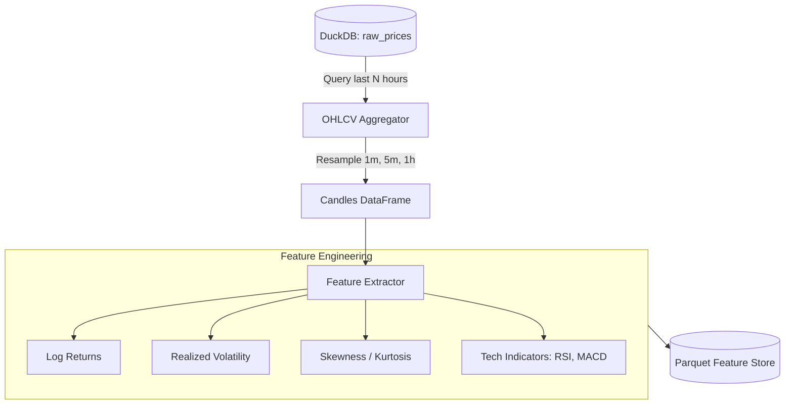

# Data Pipeline Specification

## 1. Mục tiêu
Tài liệu này định nghĩa chi tiết luồng xử lý dữ liệu, cấu trúc cơ sở dữ liệu và cơ chế giải quyết xung đột ghi (concurrency) trên DuckDB. Đây là nền tảng để các mô hình học máy và backtest engine hoạt động chính xác.

## 2. DuckDB Schema Design
DuckDB được sử dụng làm lưu trữ chính cho chuỗi thời gian (time-series). Thiết kế bảng tối ưu cho truy vấn phân tích (OLAP).

### Table: `raw_prices`
Lưu trữ tick data thô được fetch về mỗi 60s.
- `symbol` (VARCHAR): Mã tài sản (VD: "BTC", "SPY").
- `timestamp` (TIMESTAMP): Thời gian ghi nhận giá.
- `price` (DOUBLE): Giá tài sản.
- `volume` (DOUBLE): Khối lượng giao dịch (nếu có, mặc định 0 nếu oracle không cấp).
- `source` (VARCHAR): Nguồn dữ liệu (VD: "pyth", "binance").

*Lý do thiết kế*: Không dùng Index phức tạp trên DuckDB vì DuckDB tự động tối ưu qua min-max zone maps trên các cột. Sắp xếp dữ liệu theo `(symbol, timestamp)` khi insert.

## 3. Concurrency Control Strategy
**REQ-005**: Giải quyết triệt để lỗi `database is locked` của DuckDB.

- **Writer Process (Data Fetcher)**:
  - Là process duy nhất kết nối DuckDB ở chế độ ghi: `duckdb.connect('market_data.duckdb', read_only=False)`.
  - Ghi theo batch (batch insert) mỗi 60s để giảm overhead I/O.
- **Reader Processes (Live Miner, Tuner, Dashboard)**:
  - Kết nối ở chế độ chỉ đọc: `duckdb.connect('market_data.duckdb', read_only=True)`.
  - *Lý do*: DuckDB cho phép nhiều process đọc đồng thời cấu trúc file nội bộ khi có 1 process đang ghi, miễn là các process đọc mở file với cờ `read_only=True`.

## 4. Feature Engineering Pipeline
Quá trình chuyển đổi `raw_prices` thành features cho mô hình dự báo.

### Parquet Feature Store
Dữ liệu đã qua xử lý (features) được ghi ra định dạng Parquet thay vì DuckDB để phục vụ việc huấn luyện (Tuner).
- *Cấu trúc file*: `features/asset={symbol}/year={yyyy}/month={mm}/data.parquet`.
- *Lý do*: Định dạng cột (columnar) của Parquet kết hợp với phân vùng (partitioning) giúp Pandas/Polars load dữ liệu cực nhanh vào RAM mà không gây lock DB chính.

## 5. Fallback Nguồn Dữ Liệu
**REQ-006**: Đảm bảo luồng dữ liệu không bị đứt gãy.
- **Primary**: Pyth Network (độ trễ thấp, lấy giá on-chain).
- **Secondary**: Binance REST API (để backfill dữ liệu nếu Pyth sập hoặc bị rate limit).
- *Logic*: Nếu Pyth trả về timeout 3 lần liên tiếp -> Tự động switch sang gọi Binance REST.
